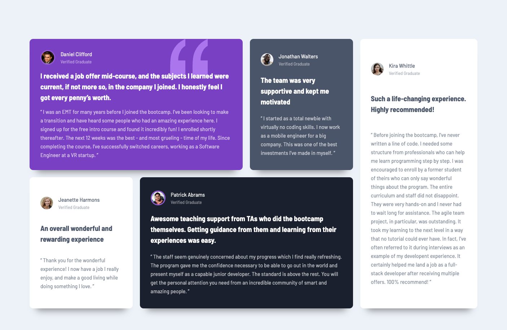

# Frontend Mentor - Testimonials grid section solution

This is a solution to the [Testimonials grid section challenge on Frontend Mentor](https://www.frontendmentor.io/challenges/testimonials-grid-section-Nnw6J7Un7). Frontend Mentor challenges help you improve your coding skills by building realistic projects.

## Table of contents

- [Overview](#overview)
  - [The challenge](#the-challenge)
  - [Screenshot](#screenshot)
  - [Links](#links)
- [My process](#my-process)
  - [Built with](#built-with)
  - [What I learned](#what-i-learned)
  - [Continued development](#continued-development)
  - [Useful resources](#useful-resources)

## Overview

### The challenge

Users should be able to:

- View the optimal layout for the site depending on their device's screen size

### Screenshot

### Links

- Solution URL: [Github](https://github.com/Saekit/FM-Testimonials-Grid-Section)
- Live Site URL: [Github Pages](https://your-live-site-url.com)

## My process

### Built with

- Semantic HTML5 markup
- CSS custom properties
- Flexbox
- CSS Grid
- Mobile-first workflow
- [React](https://reactjs.org/) - JS library
- [Vite](https://vitejs.dev/) - React framework
- [Styled Components](https://styled-components.com/) - For styles

### What I learned

I learned how to use an svg import as a background image and how to manipulate that image to be in the position you want.

### Continued development

I am continuing to learn and use grid for the layout, especially with a dynamic web page that will get a set of data from a source to be mapped to a specific layout. I realize this set layout may not work for data that contains more or less than 5 objects, so I would like to continue to think about how to make a layout that would work in all cases.

### Useful resources

- [Grid Generator](https://cssgridgenerator.io/) - This helped me create the grid I needed.
- [CSS background positioning](https://www.w3schools.com/cssref/css_pr_background-position-x.php) - This helped me place the svg image in the correct spot.
- [CSS Box Shadow](https://getcssscan.com/css-box-shadow-examples) - This has a lot of good CSS shadows.
